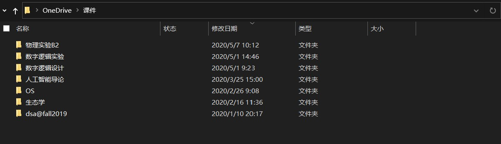

# lab8: 文件系统

我们来到了最后一个lab。**文件系统(file system)**，指的是操作系统中管理（硬盘上）持久存储数据的模块。除了硬盘上的数据，我们还可以把设备（如标准输入，标准输出）看成是文件，由文件系统进行统一的管理。之前我们曾经模拟过一个很简单的文件系统，用来存放内存置换出的页面。现在我们要来实现更加复杂的文件系统。

我们希望实现一个**虚拟文件系统（virtual file system, VFS）**, 作为操作系统和具体的文件系统之间的接口。例如，电脑上本地的硬盘和远程的云盘(例如清华云盘，OneDrive）的具体文件管理方式很可能不同，但是操作系统可以让我们用相同的操作访问这两个地方的文件。

例如，远程的云盘OneDrive，在Windows资源管理器(可以看作是虚拟文件系统提供给用户的接口)里，看起来和本地磁盘上的文件夹一模一样，也可以做和本地的文件夹相同的操作，复制，粘贴，打开。虽然背后有着网络传输，可能速度会慢很多，但是接口是一致的。

我们将用虚拟文件系统管理三类设备：

- 硬盘，我们把管理硬盘的具体文件系统叫做Simple File System
- 标准输出（控制台输出），只能写不能读
- 标准输入（键盘输入），只能读不能写

其中，标准输入和标准输出都是比较简单的设备。管理硬盘的Simple File System相对而言比较复杂。

我们的“硬盘”依然需要通过用一块内存来模拟。

在Makefile里，我们分三段构建内核镜像。

- sfs.img: 一块符合SFS文件系统的硬盘，里面存储编译好的用户程序
- swap.img: 一段初始化为0的交换区
- kernel objects: ucore内核代码的目标文件

这三部分共同组成ucore.img, 加载到QEMU里运行。我们通过链接时添加的首尾符号，把`swap.img`和`sfs.img`两段“硬盘”（实际上对应两段内存空间）找出来，然后作为“硬盘”进行管理。

注意，我们要在ucore内核开始执行之前，构造好“一块符合SFS文件系统的硬盘”，这就得另外写个程序做这个事情。这个程序就是`tools/mksfs.c`。它有500多行，看起来挺长，感兴趣的话可以通过它了解Simple File System的结构。

